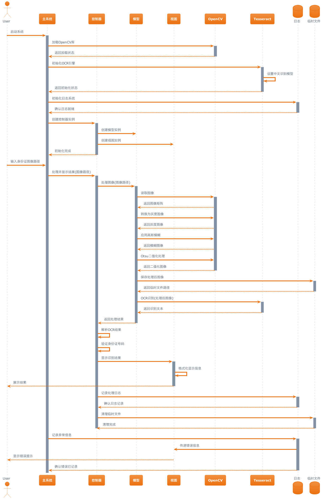

# 中华人民共和国居民身份证 OCR 识别与图像处理系统

<div align="center">
  
  <br/>
  <em>系统演示：身份证识别效果展示</em>
</div>

基于 OpenCV 和 Tesseract 的中国居民身份证光学字符识别（OCR）系统。本系统采用先进的计算机视觉技术和深度学习算法，
能够快速准确地识别身份证上的文字信息。通过多级图像预处理和优化的 OCR 引擎，即使在复杂光照条件下也能保持较高的识别
准确率。系统采用 MVC 设计模式，具有良好的可扩展性和维护性，可轻松集成到各类应用场景中。

## 功能特点

- 身份证图像预处理
- 光学字符识别（OCR）
- 中文文本提取
- 高精度识别
- 身份证号码合法性验证

## 系统要求

- Java 17 或更高版本
- Maven 3.8+
- OpenCV 4.x
- Tesseract 4.x
- MacOS/Linux/Windows

## 完整安装步骤

### 1. 安装基础依赖

```bash
# 安装 Homebrew（如果未安装）
/bin/bash -c "$(curl -fsSL https://raw.githubusercontent.com/Homebrew/install/HEAD/install.sh)"

# 安装 Java 17
brew install openjdk@17

# 安装 Maven
brew install maven

# 安装 OpenCV
brew install opencv

# 安装 Tesseract 及中文语言包
brew install tesseract
brew install tesseract-lang
````

### 2. 配置环境变量

```bash
# 配置 Java 环境
echo 'export JAVA_HOME=$(/usr/libexec/java_home -v 17)' >> ~/.zshrc

# 配置 Tesseract 数据路径
echo 'export TESSDATA_PREFIX="/opt/homebrew/share/tessdata"' >> ~/.zshrc

# 配置 OpenCV 库路径
echo 'export DYLD_LIBRARY_PATH="/opt/homebrew/lib:$DYLD_LIBRARY_PATH"' >> ~/.zshrc

# 使配置生效
source ~/.zshrc
```

### 3. 验证安装

```bash
# 验证 Java 版本
java -version

# 验证 Maven 版本
mvn -version

# 验证 Tesseract 安装
tesseract --version

# 验证 OpenCV 安装
pkg-config --modversion opencv4
```

## 构建与运行

### 构建项目

```bash
# 克隆项目
git clone https://github.com/ctkqiang/chinese_identity_ocr.git
cd chinese_identity_ocr

# 构建项目
mvn clean install
```

### 运行程序

```bash
mvn exec:java \
  -Dexec.mainClass="xin.ctkqiang.中华人民共和国居民身份证_OCR_识别与图像处理系统" \
  -Djava.library.path="/opt/homebrew/opt/opencv/share/java/opencv4" \
  -Dexec.args="<图像路径>"
```


## 运行示例

以下是系统运行的实际输出示例：

```
💡 成功加载OpenCV库
💡 Tesseract数据路径: /opt/homebrew/share/tessdata
💡 中华人民共和国居民身份证_OCR_识别与图像处理系统启动！
💡 请输入身份证图像路径:
'/Users/ctkqiang/Documents/上饶满星科技有限公司/chinese_identity_ocr/assets/test_images/9333812.png'
💡 创建临时文件/Users/ctkqiang/Documents/上饶满星科技有限公司/chinese_identity_ocr/temp/processed_1740501259703.jpg
💡 清理后的 OCR 结果: [识别结果文本]
💡 OCR识别结果: 911124198108035002
💡 OCR识别结果: 非法
-----

▶ [测试 1]: 直接显示身份证号码解析
💡
▶ [测试 2]: 控制器解析身份证信息
💡
┌───────────────────────────────────────────────┐
│ 身份证信息识别结果 │
├───────────────────────────────────────────────┤
│ 地区信息: 江西省抚州地区南丰县 (362424) │
│ 出生日期: 1976 年 11 月 06 日 │
│ 性别: 男 │
│ 校验码: 8 │
└───────────────────────────────────────────────┘

💡
✓ 测试完成

## 身份证验证算法

系统采用国家标准 GB11643-1999 规定的身份证验证算法。以下是详细的计算过程：

### 数学原理

1. **加权求和**
   设身份证号码前 17 位依次为 $a_i$，加权因子为 $w_i$，则：

   $S = \sum_{i=1}^{17} a_i \times w_i$

   其中：
   - $a_i$ 为第 i 位的数字值
   - $w_i$ 为第 i 位的加权因子：

   | 位置 (i) | 1 | 2 | 3  | 4 | 5 | 6 | 7 | 8 | 9 | 10 | 11 | 12 | 13 | 14 | 15 | 16 | 17 |
   |----------|---|---|----|---|---|---|---|---|---|----|----|----|----|----|----|----|----|
   | 因子 (wi)| 7 | 9 | 10 | 5 | 8 | 4 | 2 | 1 | 6 | 3  | 7  | 9  | 10 | 5  | 8  | 4  | 2  |

2. **取模运算**
   计算校验值 Y：

  ```
  Y = S \bmod 11
  ```

3. **校验码对应关系**
   根据 Y 值查表获得校验码 C：

   | Y 值 | 0 | 1 | 2 | 3 | 4 | 5 | 6 | 7 | 8 | 9 | 10 |
   |------|---|---|---|---|---|---|---|---|---|---|----|
   | 校验码| 1 | 0 | X | 9 | 8 | 7 | 6 | 5 | 4 | 3 | 2 |

### 验证示例

以身份证号 `110101199003077734` 为例：

1. **加权求和计算**
```
1×7 + 1×9 + 0×10 + 1×5 + 0×8 + 1×4 + 1×2 + 9×1 +
9×6 + 0×3 + 0×7 + 3×9 + 0×10 + 7×5 + 7×8 + 7×4 + 3×2
= 7 + 9 + 0 + 5 + 0 + 4 + 2 + 9 +
54 + 0 + 0 + 27 + 0 + 35 + 56 + 28 + 6
= 242
```

2. **取模运算**
```
242 ÷ 11 = 22 余 0;
Y = 0

```

3. **查表获得校验码**
```
Y = 0 对应校验码 '1'
```

4. **验证结果**
身份证最后一位为 4，与计算得到的校验码 1 不符，因此该身份证号无效。

### 算法特点

1. **数学基础**
- 采用模运算确保结果唯一性
- 加权因子经过特殊设计，提高识别准确率
- 校验码包含数字和字母，增加防伪性

2. **错误检测能力**
- 可检测单个数字的录入错误
- 可检测数字的顺序颠倒错误
- 可检测多数字同时出错的情况

3. **实现考虑**
- 运算过程简单，易于编程实现
- 计算量小，适合实时验证
- 具有良好的容错性能

## 算法




## 项目文档

<div align="center" style="margin: 20px 0">
  <a href="docs/apidocs/allclasses.html" target="_blank">
    
  </a>
</div>

完整的 API 文档可在以下位置查看：

- [本地文档](docs/apidocs/allclasses.html)
- [在线文档](https://ctkqiang.github.io/chinese_identity_ocr/apidocs/allclasses.html)


## 许可证

本项目采用 **木兰宽松许可证 (Mulan PSL)** 进行许可。  
有关详细信息，请参阅 [LICENSE](LICENSE) 文件。

[](http://license.coscl.org.cn/MulanPSL2)

## 🌟 开源项目赞助计划

### 用捐赠助力发展

感谢您使用本项目！您的支持是开源持续发展的核心动力。  
每一份捐赠都将直接用于：  
✅ 服务器与基础设施维护  
✅ 新功能开发与版本迭代  
✅ 文档优化与社区建设

点滴支持皆能汇聚成海，让我们共同打造更强大的开源工具！

---

### 🌐 全球捐赠通道

#### 国内用户

<div align="center" style="margin: 40px 0">

<div align="center">
<table>
<tr>
<td align="center" width="300">

<br />
<strong>🔵 支付宝</strong>
</td>
<td align="center" width="300">

<br />
<strong>🟢 微信支付</strong>
</td>
</tr>
</table>
</div>
</div>

#### 国际用户

<div align="center" style="margin: 40px 0">
  <a href="https://qr.alipay.com/fkx19369scgxdrkv8mxso92" target="_blank">
    
  </a>
  
  <a href="https://ko-fi.com/F1F5VCZJU" target="_blank">
    
  </a>
  
  <a href="https://www.paypal.com/paypalme/ctkqiang" target="_blank">
    
  </a>
  
  <a href="https://donate.stripe.com/00gg2nefu6TK1LqeUY" target="_blank">
    
  </a>
</div>

---

### 📌 开发者社交图谱

#### 技术交流

<div align="center" style="margin: 20px 0">
  <a href="https://github.com/ctkqiang" target="_blank">
    
  </a>
  
  <a href="https://stackoverflow.com/users/10758321/%e9%92%9f%e6%99%ba%e5%bc%ba" target="_blank">
    
  </a>
  
  <a href="https://www.linkedin.com/in/ctkqiang/" target="_blank">
    
  </a>
</div>

#### 社交互动

<div align="center" style="margin: 20px 0">
  <a href="https://www.instagram.com/ctkqiang" target="_blank">
    
  </a>
  
  <a href="https://twitch.tv/ctkqiang" target="_blank">
    
  </a>
  
  <a href="https://github.com/ctkqiang/ctkqiang/blob/main/assets/IMG_9245.JPG?raw=true" target="_blank">
    
  </a>
</div>

---

🙌 感谢您成为开源社区的重要一员！  
💬 捐赠后欢迎通过社交平台与我联系，您的名字将出现在项目致谢列表！
